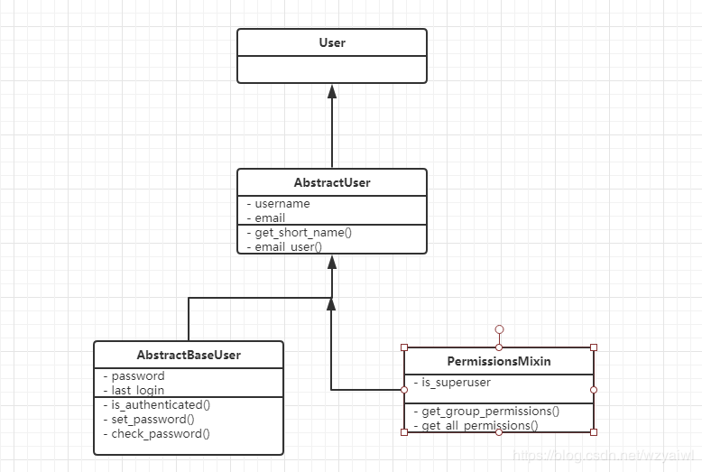

Django默认提供了用户权限管理模块auth

我们在开发一个网站的时候，无可避免的需要设计实现网站的用户系统。此时我们需要实现包括用户注册、用户登录、用户认证、注销、修改密码等功能，这还真是个麻烦的事情呢。

Django作为一个完美主义者的终极框架，当然也会想到用户的这些痛点。它内置了强大的用户认证系统--auth，可以实现上述需求。它默认使用 auth_user 表来存储用户数据。


# 1 用户权限管理模块auth中的表

user表，User是auth模块中维护用户信息的表，在数据库中该表被命名为auth_user. 该表继承自Abstractuser.  
group表，定义用户组模型，该表只包含一个name字段和一个permissions(权限)多对多关系字段，在数据库中被命名为auth_group.  
Permission,  权限表，提供表级别的权限控制，可以检查用户是否对某个表拥有增（add），改(change)，删（delete）权限。  

从数据库生成的表来看，这三张表实现了两两多对多的关联，
其中用户和组生成的第三张表是auth_user_groups,
group和permission生成的第三张表是auth_group_permissions,
用户和权限生成的第三张表是auth_user_user_permissions。这里我们主要介绍下user表。

前面我们已经通过数据迁移生成了用户权限认证系统的物流表；里面包含系统用户表，权限表，用户组，以及用户组权限关联表，用户和组关联表，用户权限关联表。

![[09_内置Auth认证系统/images/Pasted image 20240619230404.png]]


# 2 User类

在auth中user继承自AbstractUser，其中AbstractUser又继承自AbstractBaseUser和PermissionsMixin，其中AbstractBaseUser只保存了密码和登陆时间，PermissionsMixin提供了权限先关的字段，比如：is_superuser和组合权限表之间的关联。


User对象的字段
```
password：Django默认保存是加密后的密码，无法直接看到明文密码  
last_login：上一次登陆时间  
is_superuser：是否是超级管理员，是为1，否为0  
username：用户名  
first_name  
last_name  
email：邮箱  
is_staff：用户是否拥有网站的管理权限  
is_active：是否允许用户登录, 设置为 False，可以在不删除用户的前提下禁止用户登录。  
data_joined：账户创建日期  
groups： 与组多对多关联的字段  
user_permissions： 与权限关联的多对多字段，也就是是说明了为什么第三张表表为auth_user_user_permissions. 表名（user）+字段名（user_permissions）  
```


类属性
```
is_authenticated：判断是否被认证，即是否登陆  
is_anonymous： 是否为匿名用户  
username_validator：指向用于验证用户名的验证实例，默认是validators.UnicodeUsernameValidator  
```

类方法
```
get_username()：  获取用户名  
get_full_name()： 获取全名，即first_name+空格+last_name  
get_short_name()：获取first_name  
set_password(raw_password)： 设置密码,如果raw_password是None，则密码将被设置为不可用的密码，就像使用了 set_unusable_password() 一样。  
check_password(raw_password)： 检查密码是否正确。  
set_unusable_password()：将用户标记为未设置密码，即密码为None  
has_usable_password()：返回该用户是否未设置密码  
get_group_permissions()： 获取这个用户所在组中所具有的的全部权限。  
has_perm()： 判断一个用户是否具有某个权限。  
has_perms(perm_list)： 判断用户对一个权限列表是否具有权限。  
has_module_perms(package_name)： 判断对app是否有权限。 
```


# 3 常用方法


1.authenticate()：

提供了用户认证功能，即验证用户名以及密码是否正确，一般需要username 、password两个关键字参数。如果认证成功（用户名和密码正确有效），便会返回一个 User 对象。authenticate()会在该 User 对象上设置一个属性来标识后端已经认证了该用户，且该信息在后续的登录过程中是需要的，认证失败返回None。

user = auth.authenticate(username=’theuser’,password=’thepassword’)


2.login(HttpRequest, user):

该函数接受一个HttpRequest对象，以及一个经过认证的User对象。该函数实现一个用户登录的功能。它本质上会在后端为该用户生成相关session数据。

```python
def my_view(request):  
    username = request.POST['username']  
    password = request.POST['password']  
    user = auth.authenticate(username=username, password=password)  
    if user is not None:  
        auth.login(request, user)  
        # Redirect to a success page.  
        ...  
    else:  
    # Return an 'invalid login' error message.  
        ...  
```


3 logout(request)：

该函数接受一个HttpRequest对象，无返回值。当调用该函数时，当前请求的session信息会全部清除。该用户即使没有登录，使用该函数也不会报错。

```python
def logout_view(request):  
    auth.logout(request)  
    # Redirect to a success page.  
```


4 is_authenticated():
用来判断当前请求是否通过了认证。

```
def my_view(request):  
    if not request.user.is_authenticated():  
    return redirect('%s?next=%s' % (settings.LOGIN_URL, request.path))  
```

5.login_requierd()：
auth 给我们提供的一个装饰器工具，用来快捷的给某个视图函数添加登录校验。

```
from django.contrib.auth.decorators import login_required  
   
@login_required  
def my_view(request):  
    ...  
```


若用户没有登录，则会跳转到django默认的 登录URL ‘/accounts/login/ ‘ 并传递当前访问url的绝对路径 (登陆成功后，会重定向到该路径)。
如果需要自定义登录的URL，则需要在settings.py文件中通过LOGIN_URL进行修改。 LOGIN_URL = ‘/login/’ # 这里配置成你项目登录页面的路由


6 method_decorator()：
auth 给我们提供的一个装饰器工具，用来快捷的给某个类视图添加登录校验。
```
from django.contrib.auth.decorators import login_required  
from django.utils.decorators import method_decorator  
   
class Home(views.View):  
   
    @method_decorator(login_required)  
    def get(self, request):  
        return render(request, 'home.html') 
```

7 create_user()：
auth 提供的一个创建新用户的方法，需要提供必要参数（username、password）等。
```python
from django.contrib.auth.models import User  
   
user = User.objects.create_user(username = '用户名', password = '密码', email = '邮箱', ...)  
check_password(password)  
```


8 create_superuser()：
auth 提供的一个创建新的超级用户的方法，需要提供必要参数（username、password）等。
```python
from django.contrib.auth.models import User  
   
user = User.objects.create_superuser(username = '用户名', password = '密码', email = '邮箱', ...)  
check_password(password)  
```

9.permission_requires(权限,raise_exception=True)：
对视图函数指定权限验证。


# 4 Group

django.contrib.auth.models.Group定义了用户组的模型， 每个用户组拥有id和name两个字段， 该模型在数据库被映射为auth_group数据表。

User对象中有一个名为groups的多对多字段， 多对多关系由auth_user_groups数据表维护。Group对象可以通过user_set反向查询用户组中的用户。

我们可以通过创建删除Group对象来添加或删除用户组:
```
# add  
group = Group.objects.create(name=group_name)  
group.save()  
# del  
group.delete()  
```


我们可以通过标准的多对多字段操作管理用户与用户组的关系:
```python
#用户加入用户组  
user.groups.add(group)  
#或者  
group.user_set.add(user)  
  
#用户退出用户组  
user.groups.remove(group)  
#或者  
group.user_set.remove(user)  
  
#用户退出所有用户组  
user.groups.clear()  
  
#用户组中所有用户退出组  
group.user_set.clear() 
```


# 5 Permission

Django的auth系统提供了模型级的权限控制， 即可以检查用户是否对某个数据表拥有增(add), 改(change), 删(delete)权限。

auth系统无法提供对象级的权限控制， 即检查用户是否对数据表中某条记录拥有增改删的权限。如果需要对象级权限控制可以使用django-guardian。

假设在博客系统中有一张article数据表管理博文， auth可以检查某个用户是否拥有对所有博文的管理权限， 但无法检查用户对某一篇博文是否拥有管理权限。

## 5.1 检查用户权限
```python
user.has_perm方法用于检查用户是否拥有操作某个模型的权限:  
user.has_perm('blog.add_article')  
user.has_perm('blog.change_article')  
user.has_perm('blog.delete_article')  
```
上述语句检查用户是否拥有blog这个app中article模型的添加权限， 若拥有权限则返回True。
has_perm仅是进行权限检查, 即是用户没有权限它也不会阻止程序员执行相关操作。


```
@permission_required装饰器可以代替has_perm并在用户没有相应权限时重定向到登录页或者抛出异常。  
# permission_required(perm[, login_url=None, raise_exception=False])  
  
@permission_required('blog.add_article')  
def post_article(request):  
    pass  
```

每个模型默认拥有增(add), 改(change), 删(delete)权限。在django.contrib.auth.models.Permission模型中保存了项目中所有权限。

该模型在数据库中被保存为auth_permission数据表。每条权限拥有id ,name , content_type_id, codename四个字段。

## 5.2 管理用户权限

User和Permission通过多对多字段user.user_permissions关联，在数据库中由auth_user_user_permissions数据表维护。
```python
#添加权限  
user.user_permissions.add(permission)  
  
#删除权限:   
user.user_permissions.delete(permission)  
  
#清空权限:   
user.user_permissions.clear()  
```

用户拥有他所在用户组的权限， 使用用户组管理权限是一个更方便的方法。Group中包含多对多字段permissions， 在数据库中由auth_group_permissions数据表维护。
```python
#添加权限:   
group.permissions.add(permission)  
  
#删除权限:   
group.permissions.delete(permission)  
  
#清空权限:   
group.permissions.clear()  
```


## 5.3 自定义权限

在定义Model时可以使用Meta自定义权限：
```python
class Discussion(models.Model):  
  ...  
  class Meta:  
      permissions = (  
          ("create_discussion", "Can create a discussion"),  
          ("reply_discussion", "Can reply discussion"),  
      )  
```

判断用户是否拥有自定义权限:
```
user.has_perm('blog.create_discussion')  
```


# 6 视图的用户权限

无法添加或更改某个模型的用户将无法在管理员中看到。

如果我们在谈论自定义创建的视图，那么您可以创建一些检查用户权限的内容，如果没有该权限，则返回404。权限与模型相关联，组可分配各种权限。

您可以向模型添加权限：
```python
 # myproject / myapp / models.py   

 class MyModel（models.Model）：  
     class Meta：  
     permission =（  
        （'permission_code'，'友好许可描述'），  
    ）  
```

然后你可以检查一个用户是否有这样的权限：
```python
@user_passes_test（lambda u：u.has_perm（' myapp.permission_code'））  
 def some_view（request）：  
＃...  
```

使用权限，您可以使用管理界面轻松地添加或删除用户和组。
# 7 用例
## 7.1 用户注册实现

我们实现Auth认证系统里的用户注册的话，用的是auth模版models.py里定义的User模型。
![[09_内置Auth认证系统/images/Pasted image 20240619230551.png]]


通过auth内置的User，我们可以直接操作用户相关功能；

首先urls.py里定义下映射：
```python
# 跳转注册页面
path('auth/toRegister', helloWorld.views.to_register),
# 提交注册请求
path('auth/register', helloWorld.views.register),
```
![[09_内置Auth认证系统/images/Pasted image 20240619230752.png]]

templates下新建auth目录，再新建login.html和register.html两个页面；（用户注册后，跳转到
登录页面）

register.html页面源码：
```html
<!DOCTYPE html>
<html lang="en">
    <head>
        <meta charset="UTF-8" />
        <title>注册页面</title>
    </head>
    <body>
        <form action="/auth/register" method="post">
            
            <table>
                <tr>
                    <th>用户注册</th>
                </tr>
                <tr>
                    <td>用户名：</td>
                    <td><input type="text" name="username" value="{{ username }}" /></td>
                </tr>
                <tr>
                    <td>密码：</td>
                    <td>
                        <input
                            type="password"
                            name="password"
                            value="{{ password
}}"
                        />
                    </td>
                </tr>
                <tr>
                    <td>
                        <input type="submit" value="提交" />
                    </td>
                    <td>
                        <font color="red">{{ errorInfo }}</font>
                    </td>
                </tr>
            </table>
        </form>
    </body>
</html>

```

login.html页面源码（临时的）：
```html
<!DOCTYPE html>
<html lang="en">
    <head>
        <meta charset="UTF-8" />
        <title>Title</title>
    </head>
    <body>
        登录页面
    </body>
</html>

```

views.py实现to_register和register两个方法。新增用户用的是create_user，判断用户是否存在通过filter

```python
def to_register(request):
	"""
	测试，浏览器输入 http://127.0.0.1:8000/auth/toRegister
	输入用户名和密码，点提交；
	auth_user表，就会有用户数据：
	如果用户名重复，则报错提示：
	跳转注册页面
	:param request:
	:return:
	"""
	return render(request, 'auth/register.html')

def register(request):
	"""
	用户注册
	:param request:
	:return:
	"""
	username = request.POST.get('username')
	password = request.POST.get('password')
	# 检验用户名是否存在
	result = User.objects.filter(username=username)
	if result:
	return render(request, 'auth/register.html',context={"errorInfo": "该用户名已存在", "username": username, "password": password})
	User.objects.create_user(username=username, password=password)
	return render(request, "auth/login.html")
```


![[09_内置Auth认证系统/images/Pasted image 20240619231011.png]]

![[09_内置Auth认证系统/images/Pasted image 20240619231019.png]]


## 7.2 用户登录实现

用户登录功能，后端验证主要通过auth模块提供的authenticate校验方法，以及login登录方法实现。
首先urls.py里加下映射：

```
# 跳转登录页面
path('auth/toLogin', helloWorld.views.to_login),
# 提交登录请求
path('auth/login', helloWorld.views.login),
```

登录页面login.html：
```html
<!DOCTYPE html>
<html lang="en">
    <head>
        <meta charset="UTF-8" />
        <title>登录页面</title>
    </head>
    <body>
        <form action="/auth/login" method="post">
            
            <table>
                <tr>
                    <th>用户登录</th>
                </tr>
                <tr>
                    <td>用户名：</td>
                    <td><input type="text" name="username" value="{{ username }}" /></td>
                </tr>
                <tr>
                    <td>密码：</td>
                    <td>
                        <input
                            type="password"
                            name="password"
                            value="{{ password
}}"
                        />
                    </td>
                </tr>
                <tr>
                    <td>
                        <input type="submit" value="提交" />
                    </td>

                    <td>
                        <font color="red">{{ errorInfo }}</font>
                    </td>
                </tr>
            </table>
        </form>
    </body>
</html>

```

网站首页index.html，登录成功后跳转：
```html
<!DOCTYPE html>
<html lang="en">
    <head>
        <meta charset="UTF-8" />
        <title>网站首页</title>
    </head>
    <body>
        网站首页,欢迎: {{ request.user }}
    </body>
</html>

```


views.py里实现to_login和login方法。
通过auth.authenticate校验用户是否已经存在。校验用户成功后，返回的是一个封装好的用户对象；校验错误则返回None
用户对象is_active方法判断用户是否激活。
通过调用auth.login，用户登录成功之后，返回给客户端登录的凭证或者说是令牌、随机字符串，则不需要我们去操作diango_session表，会自动创建session
当执行完auth.authenticate 和auth.login 后，也就是登录成功后，我们就可以通过 request.user 直接获取到当前登录的用户对象数据
- 登录成功的情况下，该方法获得的是登录用户对象
- 登录不成功的情况下，该方法获得的是匿名对象AnonymousUser

```
def to_login(request):
	"""
	跳转登录页面
	:param request:
	:return:
	"""
	return render(request, 'auth/login.html')

def login(request):
	"""
	登录处理
	:param request:
	:return:
	"""
	username = request.POST.get('username')
	password = request.POST.get('password')
	# 通过auth模块来检验加密后的密码 ，校验成功返回用户对象，否则返回None
	resUser: User = auth.authenticate(request, username=username,password=password)
	if resUser and resUser.is_active:
		print(resUser, type(resUser))
		# 用户登录成功之后（返回给客户端登录的凭证或者说是令牌、随机字符串）
		auth.login(request, resUser)
		return render(request, 'auth/index.html')
	else:
		return render(request, 'auth/login.html',
			context={"errorInfo": "用户名或者密码错误", "username": username, "password": password})
```

![[09_内置Auth认证系统/images/Pasted image 20240619231522.png]]

![[09_内置Auth认证系统/images/Pasted image 20240619231531.png]]

## 7.3 用户修改密码实现 

用户修改密码主要通过request.user对象的set_password实现，当然校验原密码用check_password，设置完后，需要保存，调用save()方法。
我们urls.py里加下映射；
```
# 修改密码 get请求直接跳转页面，post请求执行处理
path('auth/setPwd', helloWorld.views.setPwd),
```

新建setPwd.html
```html
<!DOCTYPE html>
<html lang="en">
    <head>
        <meta charset="UTF-8" />
        <title>修改密码</title>
    </head>
    <body>
        <form action="/auth/setPwd" method="post">
            
            <table>
                <tr>
                    <th>修改密码</th>
                </tr>
                <tr>
                    <td>用户名：</td>
                    <td>
                        <input
                            type="text"
                            name="username"
                            value="{{ request.user
}}"
                            readonly
                        />
                    </td>
                </tr>
                <tr>
                    <td>原密码：</td>
                    <td><input type="password" name="oldPwd" value="{{ oldPwd }}" /></td>
                </tr>
                <tr>
                    <td>新密码：</td>
                    <td><input type="password" name="newPwd" value="{{ newPwd }}" /></td>
                </tr>
                <tr>
                    <td>
                        <input type="submit" value="提交" />
                    </td>
                    <td>
                        <font color="red">{{ errorInfo }}</font>
                    </td>
                </tr>
            </table>
        </form>
    </body>
</html>

```

views.py里实现setPwd函数：
```python
def setPwd(request):
	"""
	修改密码
	:param request:
	:return:
	"""
	if request.method == "POST":
		oldPwd = request.POST.get("oldPwd")
		newPwd = request.POST.get("newPwd")
		# 1,校验用户密码 check_password
		isRight = request.user.check_password(oldPwd)
		if not isRight:
			return render(request, 'auth/setPwd.html', context={"errorInfo": "原密码错误", "oldPwd": oldPwd, "newPwd": newPwd})
			
		# 2,设置新密码 set_password 实现加密
		request.user.set_password(newPwd)
		
		# 3,保存用户信息
		request.user.save()
		return render(request, 'auth/index.html')
		return render(request, "auth/setPwd.html")
```

![[09_内置Auth认证系统/images/Pasted image 20240619231717.png]]

![[09_内置Auth认证系统/images/Pasted image 20240619231734.png]]


## 7.4 用户注销实现 

用户注销通过auth.logout方法实现。我们来完善上前面的例子。用户登录后进入主页，显示注销功能；

如果用户没登录，则显示登录功能；

views.py里实现Logout方法：
```
def logout(request):
	"""
	注销
	:param request:
	:return:
	"""
	auth.logout(request)
	return render(request, 'auth/index.html')
```

再实现一个跳转主页的方法to_index：
```
def to_index(request):
"""
跳转主页
:param request:
:return:
"""
return render(request, 'auth/index.html')
```

urls.py里加映射：
```
# 跳转主页
path('auth/index', helloWorld.views.to_index),
# 用户注销
path('auth/logout', helloWorld.views.logout),
```

主页index.html修改如下：
```html
<!DOCTYPE html>
<html lang="en">
    <head>
        <meta charset="UTF-8" />
        <title>网站首页</title>
    </head>
    <body>
        网站首页  ,欢迎: {{ request.user }}<br />
        <a href="/auth/logout">注销</a>
        
        <a href="/auth/toLogin">登录</a>
        
    </body>
</html>

```

通过is_authenticated()方法可以判断用户是否登录认证；

![[09_内置Auth认证系统/images/Pasted image 20240619232004.png]]

![[09_内置Auth认证系统/images/Pasted image 20240619232012.png]]

# 8 用法实例
## 8.1 简单的认证

**Login_required 装饰器**

判断是否登陆，没有就自动重定向某个地方
用法：（局限于装饰函数）（如果要装饰一个类，则不能，要使用method_decorator）

```
@login_required(login_url='users:login')
def index_fn(reuqest):
    return HttpResponse('大家都是大牛')

```

自动跳转到login页面


登陆后：

----


**method_decorator装饰器**

@method_decorator(login_required(login_url='users:login'),name='dispatch')
class Index(View):
    def get(self, request):
        return render(request, 'admin/index.html', context={'request': request})

用法基本一样也就是一个是类视图一个是函数视图。

但是是否每一个都需要添加呢？不符合优秀程序员的做法（手动滑稽）因为实在是太丑了。

## 8.2 Minxin认证

**LoginRequired Mixin**

需要设定重定向的URL（有一点restful的风格）

```python
class Index(LoginRequiredMixin,View):
    login_url = 'users:login'
    def get(self, request):
        return render(request, 'admin/index.html', context={'request': request})
```

聪明的看得出来了，是否每一次都添加login_url呢，这里显然不是的，可以将login_url设置在Settings里面，我的Mixin会自动去settings里面寻找LOGIN_URL的参数。


?next=/admin/        可以自定义next   
@login_required(redirect_field_name='my_redirect_field')   这样就可以代替next

自动帮我们添加一个查询的参数在URL上面。

---

**user_passes_test**

这个比较通用于函数视图

以下为官方文档。 描述为判断登陆的用户的邮箱以‘@example.com’结尾，就为True，允许访问，如果相反，那么就禁止访问。可自定义


---

**userPassesTestMixin**

这个通用于类视图。

```python
class Index(UserPassesTestMixin,View):
    def test_func(self):
        return self.request.user.username.endswith('son')

    def get(self, request):
        return render(request, 'admin/index.html', context={'request': request})
```

test_func为Mixin所定的。测试是否通过，为TRUE则可以进入，FALSE为相反。

## 8.3 权限

**permission_required decorator**

首先这里要注意权限和认证的区别，认证给你登陆了，但不一定给你看某些好看的东西。除非微信转钱。

permission_required(perm.login_url=None,raise_exception=False)

perm为权限多个权限就可以用一个列表或者元组都行。放在函数视图里面。


perm 第一部分模型名字 第二部分为codename

---

**permissionRequiredMixin mixin**

使用于类视图里面。

```python
lass TagManage(PermissionRequiredMixin,View):
    """
    create tags manage view
    route: admin/tags/int
    """
    permission_required = ('news.add_tag', 'news.view_tag')
    raise_exception = True # 403
    def get(self, request):
```

没有权限直接403
