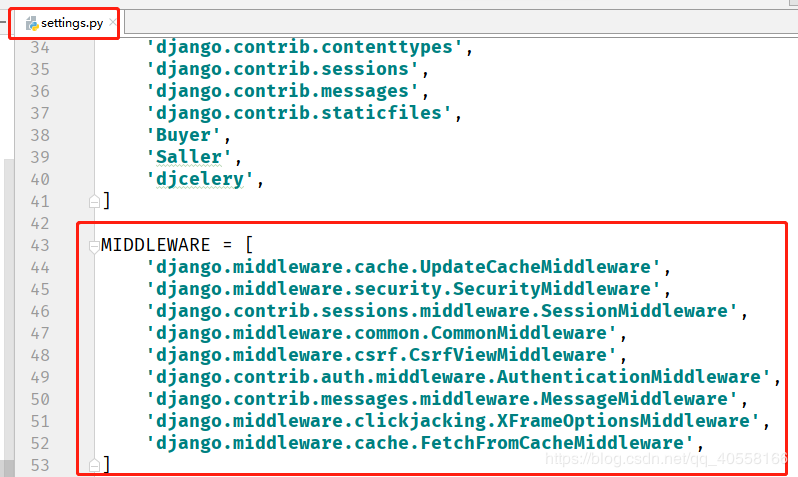
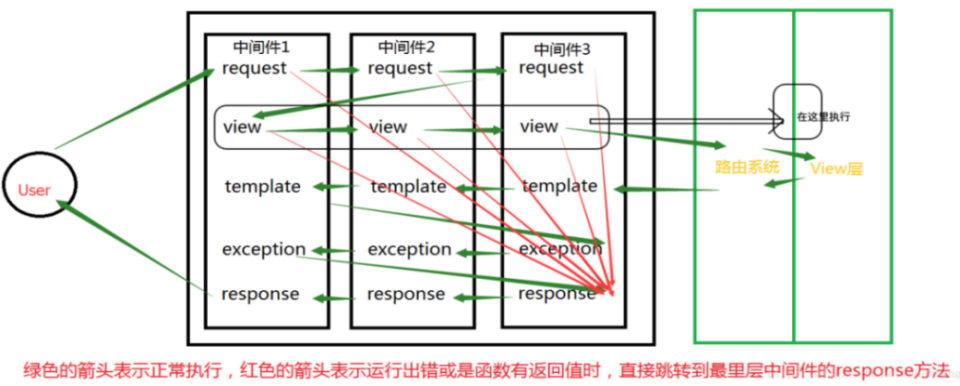
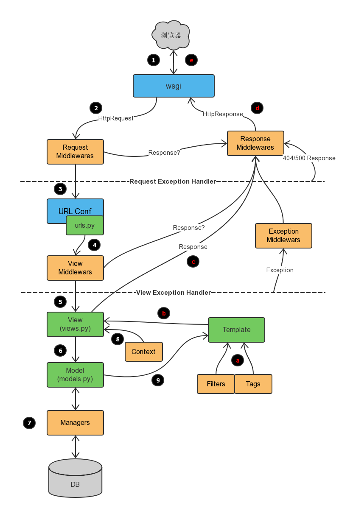

# 1 什么是中间件

django的中间件（middleware）是一个轻量级的插件系统，在django中的请求和响应中，可以利用中间件干预视图的请求和响应。


# 2 如何启用中间件

若要启用中间件组件，请将其添加到 Django 配置文件settings.py的 MIDDLEWARE 配置项列表中。




# 3 五大钩子函数

传统方式自定义中间件其实就是在编写五大钩子函数：

process_request(self,request)
process_response(self, request, response)
process_view(self, request, view_func, view_args, view_kwargs)
process_exception(self, request, exception)
process_template_response(self,request,response)

可以实现其中的任意一个或多个！

# 4 中间件的顺序问题

从上一部分可以看出，中间件是有多个的，既然有多个必然涉及到优先级或顺序问题，顺序大体上符合先来后到（不存在插队类型的优先级，要么正序，要么逆序，不能插队跳跃执行）

MIDDLEWARE 的顺序很重要，具有先后关系，因为有些中间件会依赖其他中间件。例如： AuthenticationMiddleware 需要在会话中间件中存储的经过身份验证的用户信息，因此它必须在 SessionMiddleware 后面运行 。

在请求阶段，调用视图之前，Django 按照定义的顺序执行中间件 MIDDLEWARE，自顶向下。

你可以把它想象成一个洋葱：每个中间件类都是一个“皮层”，它包裹起了洋葱的核心–实际业务视图。如果请求通过了洋葱的所有中间件层，一直到内核的视图，那么响应将在返回的过程中以相反的顺序再通过每个中间件层，最终返回给用户。

如果某个层的执行过程认为当前的请求应该被拒绝，或者发生了某些错误，导致短路，直接返回了一个响应，那么剩下的中间件以及核心的视图函数都不会被执行。



更详细的执行流 




# 5 各个中间件的作用 

Cache:缓存中间件
如果启用了该中间件，Django会以CACHE_MIDDLEWARE_SECONDS 配置的参数进行全站级别的缓存。


Common:通用中间件
禁止DISALLOWED_USER_AGENTS中的用户代理访问服务器
自动为URL添加斜杠后缀和www前缀功能。如果配置项 APPEND_SLASH 为True ，并且访问的URL 没有斜杠后缀，在URLconf中没有匹配成功，将自动添加斜杠，然后再次匹配，如果匹配成功，就跳转到对应的url。 PREPEND_WWW 的功能类似。
为非流式响应设置Content-Length头部信息。
\

GZip: 内容压缩中间件
用于减小响应体积，降低带宽压力，提高传输速度。
该中间件必须位于其它所有需要读写响应体内容的中间件之前。


Locale:本地化中间件
用于处理国际化和本地化，语言翻译。


Message:消息中间件
基于cookie或者会话的消息功能，比较常用。


Security:安全中间件


Site:站点框架。
这是一个很有用，但又被忽视的功能。
它可以让你的Django具备多站点支持的功能。
通过增加一个site属性，区分当前request请求访问的对应站点。
无需多个IP或域名，无需开启多个服务器，只需要一个site属性，就能搞定多站点服务。 `


Authentication:认证框架
Django最主要的中间件之一，提供用户认证服务。


CSRF protection:提供CSRF防御机制的中间件


X-Frame-Options:点击劫持防御中间件

# 6 例子

这个需求中似乎没有需要用到Middleware的地方，不过我们可以生造一个，来练练手。

我们有这样一个需求，统计首页每次访问所消耗的时间，也就是wsgi接口或者socket接口接到请求，到最终返回的时间。先来创建一个middlewares.py的文件吧，在views.py的同级目录中。我们先来看下完整的代码：

```python
# coding:utf-8
import time

from django.utils.deprecation import MiddlewareMixin
from django.urls import reverse


class TimeItMiddleware(MiddlewareMixin):
    def process_request(self, request):
        return

    def process_view(self, request, func, *args, **kwargs):
        if request.path != reverse('index'):
            return None

        start = time.time()
        response = func(request)
        costed = time.time() - start
        print('{:.2f}s'.format(costed))
        return response

    def process_exception(self, request, exception):
        pass

    def process_template_response(self, request, response):
        return response

    def process_response(self, request, response):
        return response
```


上面的代码中列出了一个Middleware的完整接口，虽然我们只用到了``process_view``。下面我们来逐个了解下:

* ``process_request`` - 一个请求来到middelware层，进入的第一个方法。一般情况我们可以在这里做一些校验，比如用户登录，或者HTTP中是否有认证头之类的验证。这个方法需要两种返回值，HttpResponse或者None，如果返回HttpResponse，那么接下来的处理方法只会执行``process_response``，其他的方法将不会被执行。这里**需要注意的是**，如果你的middleware在settings配置的MIDDLEWARE_CLASS的第一个的话，那么剩下的middleware也不会被执行。另外一个返回值是None，如果返回None，那么Django会继续执行其他的方法。

* ``process_view`` - 这个方法是在``process_request``之后执行的，参数如上面代码所示，其中的func就是我们将要执行的view方法，因此我们要统计一个view的执行时间，可以在这里来做。它的返回值跟``process_request``一样，HttpResponse/None，逻辑也是一样。如果返回None，那么Django会帮你执行view函数，从而得到最终的Response。

* ``process_template_response`` - 执行完上面的方法，并且Django帮忙我们执行完view之后，拿到最终的response，如果是使用了模板的Response(是指通过``return render(request, 'index.html', context={})``的方式返回Response，就会来到这个方法中。这个方法中我们可以对response做一下操作，比如``Content-Type``设置，或者其他HEADER的修改/增加。

* ``process_response`` - 当所有流程都处理完毕，就来到了这个方法，这个方法的逻辑跟``process_template_response``是完全一样的。只是``process_template_response``是针对带有模板的response的处理。

* ``process_exception`` - 上面的所有处理方法是按顺序介绍的，而这个不太一样。只有在发生异常时，才会进入到这个方法。哪个阶段发生的异常呢？可以简单的理解为在将要调用的view中出现异常（就是在``process_view``的``func``函数中）或者返回的模板Response在render时发生的异常，会进入到这个方法中。但是**需要注意的是**，如果你在``process_view``中手动调用了``func``，就像我们上面做的那样，那就不会触发``process_exception``了。这个方法接收到异常之后，可以选择处理异常，然后返回一个含有异常信息的HttpResponse，或者直接返回None，不处理，这种情况Django会使用自己的异常模板。


这是一层Middleware中所有方法的执行顺序和说明，那么如果有多个Middleware配置，执行顺序应该是怎样的呢？我们可以通过下面的一个图来理解下。


# 7 可能遇到问题

## 7.1 **全局异常object() takes no parameters**


错误信息如下

```
#  File "C:\python\lib\site-packages\django\core\handlers\wsgi.py", line 151, in __init__
#     self.load_middleware()
#   File "C:\python\lib\site-packages\django\core\handlers\base.py", line 82, in load_middleware
#     mw_instance = middleware(handler)
# TypeError: object() takes no parameters

```


出错原始代码：
```
# from django.http import HttpResponse
# class MyException(object):
#     def process_exception(request,response, exception):
#         return HttpResponse(exception.message)
```


正确代码1:
```
# class MyException(object):
#     def __init__(self, get_response):
#         self.get_response = get_response
#
#     def __call__(self, request):
#         return self.get_response(request)
#
#     def process_exception(self, request, exception):
#         return HttpResponse(exception)

```


正确代码2
```python
from django.http import HttpResponse
from django.utils.deprecation import MiddlewareMixin

class MyException(MiddlewareMixin):
    def process_exception(self, request, exception):
        return HttpResponse(exception)
```

## 7.2 **兼容 Django新版本和旧版本**

```python
try:
    from django.utils.deprecation import MiddlewareMixin  # Django 1.10.x
except ImportError:
    MiddlewareMixin = object  # Django 1.4.x - Django 1.9.x
 
class SimpleMiddleware(MiddlewareMixin):
    def process_request(self, request):
        pass
 
    def process_response(request, response):
        pass
```
